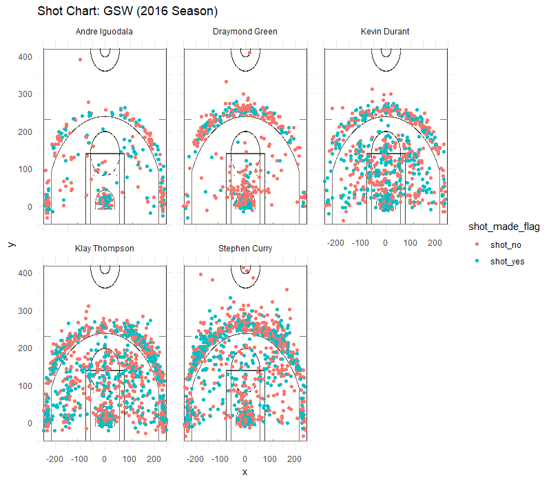

```{r setup, include=FALSE}
knitr::opts_chunk$set(echo = TRUE)
library(dplyr)
```

```{r charts}
data <- read.csv('../data/shots-data.csv')
# Two Point Table
two_point <- summarise(group_by(data, name), total = length(data$shot_type[shot_type == '2PT Field Goal']), made = length(data$shot_type[shot_type == '2PT Field Goal' & shot_made_flag == 'shot_yes']))
two_point = arrange(mutate(two_point, perc_made = made / total), desc(perc_made))
two_point

# Three Point Table
three_point <- summarise(group_by(data, name), total = length(data$shot_type[shot_type == '3PT Field Goal']), made = length(data$shot_type[shot_type == '3PT Field Goal' & shot_made_flag == 'shot_yes']))
three_point = arrange(mutate(three_point, perc_made = made / total), desc(perc_made))
three_point

# Overall Table
overall <- summarise(group_by(data, name), total = length(data$shot_type), made = length(data$shot_type[shot_made_flag == 'shot_yes']))
overall = arrange(mutate(overall, perc_made = made / total), desc(perc_made))
overall
```

## Golden State Warriors Shooting Statistics

Strength in numbers. This iconic slogan of the Golden State Warriors proves itself true through the historic streaks and stats of the team. Though hitting a blunder in the 2016 Finals, losing in Game 7 to the Cleveland Cavaliers, the data is real: the Warriors have some of the highest stats in the NBA. What is the secret to the Warriors' strong scores? In this article, we will break down shooting statistics and take a deeper look into the points that build up this strength in numbers.

### Background and Data

The Golden State Warriors are an American professional basketball team led by Steve Kerr based in Oakland, California. They compete in the NBA, the National Basketball Association. Today, we are going to look at the data of five key members of the Warriors: Andre Iguodala, Draymond Green, Kevin Durant, Klay Thompson, and Stephen Curry.

```{r out.width = '80%', echo = FALSE, fig.align = 'center'}

```

From the chart, we get a visual representation of each of these five team member's shots: those scored and those missed. We can also see roughly where each shot was taken from. Just from looking at these charts, it seems that Kevin Durant, Klay Thompson, and Stephen Curry have similar charts, while Andre Iguodala and Draymond Green are more of the outliers. Though similar, upon closer examination we can see who has greater strength in shooting 2 pointers and who has greater strength in 3 pointers. To get a better sense of these numbers and to ease comparison, we will take a look at the exact data and calculate percentages of shot points. First, let's get a brief introduction to each of these five players and their stats, then compare and analyze as a group.

### Andre Iguodala

Andre Iguodala, the small forward and shooting guard of the team, was an NBA All-Star in 2012. Let's take a look at his shots in 2016.

From the chart, we get a visual representation of the shots Iguodala has taken and the ones which he scored and missed. From calculating the exact percentages, the percentage of two-pointers he made is approximately 63.80%, while the percentage of three-pointers he made is approximately 36.02%. Iguodala is actually the highest two-point scorer of the five. 

### Draymond Green
Let's take a look at Draymond Green next. Green plays primarily in the power forward position. He is a three-time NBA champion as well as three-time NBA All-Star. 

From looking at the chart, Green seems to have a larger number of red points than the other four players, meaning he has missed more shots. Is this true? Looking at the data, Green has made approximately 49.42% of 2-pointers and approximately 31.90% of 3-pointers, putting him as the lowest scorer of the five.

### Kevin Durant
Next, we examine the scores of Kevin Durant, an All-Star forward. He is a two-time champion and 2-time NBA Most Valuable Player. His shots are very evenly spread out, as we can see from the chart. Regarding his exact scores, he has made 60.65% of his 2-pointers and 38.60% of his three-pointers. Pretty good!

### Klay Thompson
Next up, we have Klay Thompson, a shooting guard. Thompson is credited as one of the greatest shooters in NBA. We will see if his 2016 stats align with that! He is a five-time All-Star and a three-time NBA champion.

From the visual, his shots are fairly scattered and spread. His stats are 51.41% of 2-pointers made, and 41.41% of 3-pointers made. That puts him as the highest 3-pointer scorer!

### Stephen Curry
Alright, last but not least, we have Stephen Curry, point guard. Curry has some impressive titles, being a six-time NBA All-Star, two-time NBA Most Valuable Player, and 3-time champion.

Curry has made approximately 54.00% of his attempted 2-pointers, and approximately 40.76% of his attempted 3-pointers.

### Discussion
Now, let's pull all the data together to compare the players, as well as analyze how their mutual effort pushes them to the top. First, a look at two-point shots made by the five players. This is a summary of the stats we have previously talked about.
```{r}
# Two Point Table
two_point <- summarise(group_by(data, name), total = length(shot_type[shot_type == '2PT Field Goal']), made = length(shot_type[shot_type == '2PT Field Goal' & shot_made_flag == 'shot_yes']))
two_point = arrange(mutate(two_point, perc_made = made / total), desc(perc_made))
two_point
```
All the players make almost half of their attempted two-pointers or more. Iguodala comes in as the top two-point scorer, at almost 63.81% of shots made, while Durant follows with 60.65%. Now, let's rank the players for 3-pointers.
```{r}
# Three Point Table
three_point <- summarise(group_by(data, name), total = length(shot_type[shot_type == '3PT Field Goal']), made = length(shot_type[shot_type == '3PT Field Goal' & shot_made_flag == 'shot_yes']))
three_point = arrange(mutate(three_point, perc_made = made / total), desc(perc_made))
three_point
```
The percentages are smaller than for two-pointers, as expected. Here, we see a pretty different ordering of names. Thompson comes in as the highest 3-point scorer, at 42.41%, while Curry follows closely with 40.76%. The rest are also relatively close. The Warriors seems to be pretty strong in scoring. Finally, let's take a look at the stats of combined two-pointers and three-pointers: the overall shots data.

```{r}
# Overall Table
overall <- summarise(group_by(data, name), total = length(shot_type), made = length(shot_type[shot_made_flag == 'shot_yes']))
overall = arrange(mutate(overall, perc_made = made / total), desc(perc_made))
overall
```
Though not the top two-point scorer nor the top three-point scorer, Durant pulls in as the top overall scorer, with almost 54.1% of shots made! We also see here that even though Curry makes a good amount of 3-pointers, he ranks second to last overall. 

Now that we have seen the percentage of overall shots made, let's take a look at how many points each player made for the team to get a further look into the breakdown of the Warriors' numbers. Here is a graph of the total number of points each of these five members scored for the team in 2016.
```{r}
two <- arrange(two_point, name)
three <- arrange(three_point, name)
both <- arrange(overall, name)
points_from_2 <- two$made * 2
points_from_3 <- three$made * 2
points_overall <- points_from_2 + points_from_3
points_overall_table <- arrange(mutate(both, total_points = points_overall), desc(points_overall))
only_points <- select(arrange(mutate(both, total_points = points_overall), desc(points_overall)), name, total_points)
only_points
```
```{r}
as.data.frame(points_overall_table)
points_overall_table$name <- factor(points_overall_table$name, levels = points_overall_table$name[order(points_overall_table$total_points)])
ggplot(points_overall_table, aes(name, total)) + geom_bar(stat = 'identity') + coord_flip() + xlab('Player') + ylab('Total Shots') + ggtitle('Total Shots Attempted (2016)')
ggplot(points_overall_table, aes(name, total_points)) + geom_bar(stat = 'identity') + coord_flip() + xlab('Player') + ylab('Total Points Scored') + ggtitle('Total Points Scored (2016)')
```

Because of his high amount of times shot as well as high amount of 3-pointers, Curry comes in first in terms of total number of points scored overall even though Durant made the highest percentages of shots. The ranking of the total number of shots attempted aligns with the ranking of total points scored, so there are no surprises there. 

Now, we can turn back to the percentages and make our observations and conclusions of what best helps the Warriors boost their numbers there.

### Conclusion and Summary
Now that we have taken a look at the data and drawn some useful graphs and visuals, let's take a moment to digest what we have discovered. Looking at two-pointers, we found that Andre Iguodala had the highest percentages of scored shots. For three-pointers, Thompson held the lead. However, overall, Durant scored the highest percentage of shots, followed by Iguodala. Because the players have a better percentage of two-pointers scored, these contribute most to their overall score. We see that each of the players has different stregnths and weaknesses, but together, they balance each other out and are able to score highly, even for those who do not have the highest percentage like Curry. Seems like the Warriors hold true to their "Strength in Numbers!"


